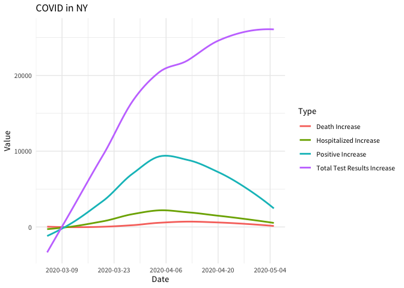

# covid19us

<!-- badges: start -->

[](https://travis-ci.org/aedobbyn/covid19us)
[](https://ci.appveyor.com/project/aedobbyn/covid19us)
[](https://codecov.io/gh/aedobbyn/covid19us)
[](https://CRAN.R-project.org/package=covid19us)
[](https://opensource.org/licenses/MIT)
<!-- [](https://github.com/metacran/cranlogs.app) -->
<!-- badges: end -->

This is an R wrapper around the [COVID Tracking Project
API](https://covidtracking.com/api/). It provides updates on the spread
of the virus in the US with a few simple functions.

## Installation

    install.packages("covid19us")

Or the dev version:

    devtools::install_github("aedobbyn/covid19us")

## Examples

``` r
library(covid19us)
```

Get the most recent COVID-19 top-line data for the country:

``` r
get_us_current()
#> # A tibble: 1 x 18
#>   positive negative pending hospitalized_cu… hospitalized_cu… in_icu_currently
#>      <int>    <int>   <int>            <int>            <int>            <int>
#> 1  1195605  6348723    2633            50906           129357             9348
#> # … with 12 more variables: in_icu_cumulative <int>,
#> #   on_ventilator_currently <int>, on_ventilator_cumulative <int>,
#> #   recovered <int>, hash <chr>, last_modified <chr>, death <int>,
#> #   hospitalized <int>, total <int>, total_test_results <int>, notes <chr>,
#> #   request_datetime <dttm>
```

Or the same by state:

``` r
get_states_current()
#> Warning: All formats failed to parse. No formats found.

#> Warning: All formats failed to parse. No formats found.
#> # A tibble: 56 x 30
#>    state positive positive_score negative_score negative_regula…
#>    <chr>    <int>          <int>          <int>            <int>
#>  1 AK         371              1              1                1
#>  2 AL        8285              1              1                0
#>  3 AR        3496              1              1                1
#>  4 AZ        9305              1              1                0
#>  5 CA       56212              1              1                0
#>  6 CO       16907              1              1                1
#>  7 CT       30621              1              1                1
#>  8 DC        5322              1              1                1
#>  9 DE        5371              1              1                1
#> 10 FL       37439              1              1                1
#> # … with 46 more rows, and 25 more variables: commercial_score <int>,
#> #   grade <chr>, score <int>, notes <chr>, data_quality_grade <chr>,
#> #   negative <int>, pending <int>, hospitalized_currently <int>,
#> #   hospitalized_cumulative <int>, in_icu_currently <int>,
#> #   in_icu_cumulative <int>, on_ventilator_currently <int>,
#> #   on_ventilator_cumulative <int>, recovered <int>, last_update <dttm>,
#> #   check_time <dttm>, death <int>, hospitalized <int>, total <int>,
#> #   total_test_results <int>, fips <chr>, date_modified <dttm>,
#> #   date_checked <dttm>, hash <chr>, request_datetime <dttm>
```

Daily state counts can be filtered by state and/or date:

``` r
get_states_daily(
  state = "NY", 
  date = "2020-03-17"
)
#> # A tibble: 1 x 27
#>   date       state positive negative pending hospitalized_cu… hospitalized_cu…
#>   <date>     <chr>    <int>    <int>   <int>            <int>            <int>
#> 1 2020-03-17 NY        1700     5506      NA              325               NA
#> # … with 20 more variables: in_icu_currently <int>, in_icu_cumulative <int>,
#> #   on_ventilator_currently <int>, on_ventilator_cumulative <int>,
#> #   recovered <int>, data_quality_grade <chr>, last_update <dttm>, hash <chr>,
#> #   date_checked <dttm>, death <int>, hospitalized <int>, total <int>,
#> #   total_test_results <int>, fips <chr>, death_increase <int>,
#> #   hospitalized_increase <int>, negative_increase <int>,
#> #   positive_increase <int>, total_test_results_increase <int>,
#> #   request_datetime <dttm>
```

For data in long format:

``` r
(dat <- refresh_covid19us())
#> # A tibble: 65,227 x 7
#>    date       location location_type location_code location_code_t… data_type
#>    <date>     <chr>    <chr>         <chr>         <chr>            <chr>    
#>  1 2020-05-05 AK       state         02            fips_code        positive 
#>  2 2020-05-05 AK       state         02            fips_code        negative 
#>  3 2020-05-05 AK       state         02            fips_code        pending  
#>  4 2020-05-05 AK       state         02            fips_code        hospital…
#>  5 2020-05-05 AK       state         02            fips_code        hospital…
#>  6 2020-05-05 AK       state         02            fips_code        in_icu_c…
#>  7 2020-05-05 AK       state         02            fips_code        in_icu_c…
#>  8 2020-05-05 AK       state         02            fips_code        on_venti…
#>  9 2020-05-05 AK       state         02            fips_code        on_venti…
#> 10 2020-05-05 AK       state         02            fips_code        recovered
#> # … with 65,217 more rows, and 1 more variable: value <int>
```

Which can be easier to plot

``` r
library(dplyr)
library(ggplot2)

dat %>% 
  filter(
    location == "NY" &
      data_type %in% 
      c(
        "positive_increase",
        "total_test_results_increase",
        "death_increase",
        "hospitalized_increase"
      )
  ) %>% 
  mutate(
    Type = data_type %>% 
      stringr::str_replace_all("_", " ") %>% 
      stringr::str_to_title()
  ) %>% 
  arrange(date) %>% 
  ggplot(aes(date, value, color = Type)) +
  geom_smooth(se = FALSE) + 
  scale_x_date(date_breaks = "2 weeks") +
  labs(title = "COVID in NY") +
  xlab("Date") +
  ylab("Value") +
  theme_minimal(base_family = "Source Sans Pro")
```



To get information about the data:

``` r
get_info_covid19us()
#> # A tibble: 1 x 10
#>   data_set_name package_name function_to_get… data_details data_url license_url
#>   <chr>         <chr>        <chr>            <chr>        <chr>    <chr>      
#> 1 covid19us     covid19us    refresh_covid19… Open Source… https:/… https://gi…
#> # … with 4 more variables: data_types <chr>, location_types <chr>,
#> #   spatial_extent <chr>, has_geospatial_info <lgl>
```

## All Functions

    get_counties_info
    get_info_covid19us
    get_states_current
    get_states_daily
    get_states_info
    get_tracker_urls
    get_us_current
    get_us_daily
    refresh_covid19us

## Other Details

  - All of the data sources can be found with `get_tracker_urls()`
    
      - The `filter` column gives information about how the [COVID
        Tracking Project’s
        scraper](https://github.com/COVID19Tracking/covid-tracking)
        currently scrapes data from the page (xpaths, CSS selectors,
        functions used, etc.)

  - State breakdowns include DC as well as some US territories including
    American Samoa (AS), Guam (GU), Northern Mariana Islands (MP),
    Puerto Rico (PR), and the Virgin Islands (VI)

  - Acronyms
    
      - PUI: persons under investigation
      - PUM: persons under monitoring (one step before PUI)

  - Time zone used is Eastern Standard Time

-----

**[PR](https://github.com/aedobbyn/covid19us/pulls)s and [bug reports /
feature requests](https://github.com/aedobbyn/covid19us/issues)
welcome.** Stay safe\!
